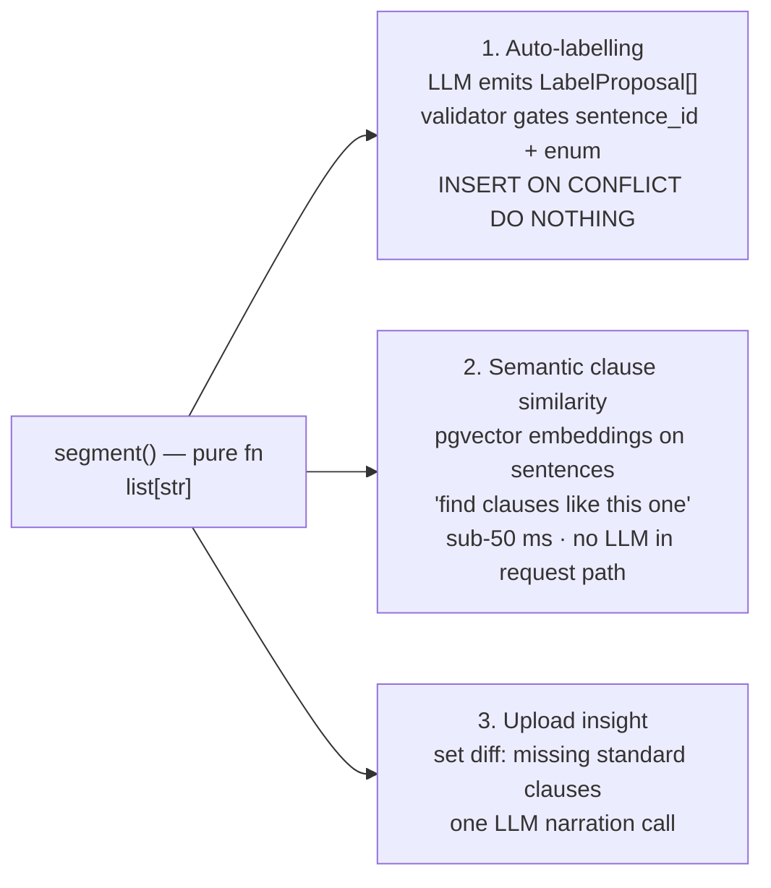

# Legartis Contract Clause Tracker

A small web app for legal teams to upload contracts, label individual sentences with a clause type (e.g. *Limitation of Liability*, *Termination for Convenience*, *Non-Compete*), and explore the dataset through a searchable, filterable, groupable dashboard.

> Built against the [Legartis full-stack case study](docs/case-study.pdf). Target budget: **3–4 hours**. The case study weights restraint (*"backend code should be minimal"*) and intuitive UX, both of which informed the choices below.

## Stack

| Layer       | Choice                                                                                  |
|-------------|-----------------------------------------------------------------------------------------|
| Backend     | **FastAPI** · SQLAlchemy 2.0 async · Alembic · `pysbd` (sentence segmentation) · `uv`   |
| Frontend    | **Angular 21** (standalone, signals, new control flow) · **Angular Material (M3)**      |
| Database    | **PostgreSQL 16** in prod (docker-compose), SQLite (aiosqlite) in tests + local dev      |
| Tests       | **pytest** + httpx (backend, 24 specs) · **Playwright** e2e (frontend, 3 critical flows) |
| Container   | Single `docker-compose.yml` at repo root                                                |

## Quick start

### One command (docker-compose)

```bash
docker compose up --build
```

- Frontend: <http://localhost:4200>
- API docs (Swagger): <http://localhost:8000/docs>
- Postgres on `localhost:5432` (`legartis` / `legartis`)

### Local development (no Docker)

```bash
# backend (terminal 1) — uses a file-backed SQLite, table creation is automatic
cd backend
uv sync
DATABASE_URL="sqlite+aiosqlite:///./dev.db" uv run uvicorn app.main:app --reload --port 8000

# frontend (terminal 2) — proxies /api/* to localhost:8000
cd frontend
npm install
npx ng serve
```

Open <http://localhost:4200>.

### Running the tests

```bash
# backend (in-memory SQLite, no external DB needed)
cd backend && uv run pytest

# frontend type check + production build
cd frontend && npx tsc --noEmit && npx ng build

# e2e (requires the stack running on :4200 + :8000)
cd frontend && npx playwright test
```

## Domain in one diagram

```
Document  1 ── n  Sentence  1 ── n  Label  ── clause_type  (one of 7 enum values)
                                              source       (MANUAL | AUTO)
                                              confidence   (nullable; populated for AUTO)
```

A **clause is always a single sentence** — that is the hard constraint from the case study.
We never merge or split sentences and we preserve the original text byte-for-byte.

The seven seed clause types: *Limitation of Liability · Termination for Convenience · Non-Compete · Confidentiality · Governing Law · Indemnification · Force Majeure*.

## API surface (7 endpoints — small on purpose)

| Method | Path                              | Purpose                                                              |
|--------|-----------------------------------|----------------------------------------------------------------------|
| GET    | `/healthz`                        | `{ok: true}` — container health probe                                |
| GET    | `/clause-types`                   | The seven seed types as `[{value, label}]`                           |
| POST   | `/documents` (multipart)          | Upload `.txt` / `.md`, segment, persist, return the document         |
| GET    | `/documents?q=&type=&group_by=`   | Dashboard: case-insensitive search, multi-select OR filter, grouping |
| GET    | `/documents/{id}`                 | Full document with sentences + labels                                |
| POST   | `/sentences/{id}/labels`          | Apply a clause-type label (idempotent via 409 on duplicate)          |
| DELETE | `/labels/{id}`                    | Remove a label                                                       |

Full interactive docs at `/docs` when the backend is running.

## Design decisions

These are the questions I had to answer along the way. Each one is a deliberate trade-off, not a default.

**Sentence segmentation: `pysbd` over spaCy / regex.**
The case study defines a clause as a single sentence, so segmentation quality matters. `pysbd` is a deterministic, pure-Python segmenter that handles legal abbreviations (`Mr.`, `Jan. 1, 2025`, `i.e.`) without a model download. A naïve regex on `[.!?]` would have lost the first day to false splits. spaCy was overkill (~350 MB model).
Markdown leaders (`#`, `-`, `>`, `1.`) are stripped before segmentation with a tiny per-line regex so headings/bullets become their own sentences rather than being absorbed into the next one. Markdown stripping is contained to one file (`backend/app/segmentation.py`) and is a pure function — the natural seam for the future auto-labeler.

**Clause types: dynamic `clause_types` table with full CRUD.**
The original design used a closed `StrEnum` + Postgres `CHECK` constraint and is documented in [docs/adr/0001-dynamic-clause-types.md](docs/adr/0001-dynamic-clause-types.md). It was reversed once it became clear the AI-proposed-types extension (see `docs/ai-features.md`) needed to extend the taxonomy at runtime. The wire format stays `clause_type: str`; deletes cascade to labels; the immutable `value` is auto-slugified from `label` and silently suffixed (`_2`, `_3`, …) on collision.

**`source` + `confidence` columns on `labels` — schema-only seam for auto-labeling.**
The case study hints at a pair-programming follow-up to add automatic labeling. Adding `source ENUM('MANUAL','AUTO')` and nullable `confidence FLOAT` now (with `MANUAL` as the default) means the auto-labeler later becomes a single `INSERT … ON CONFLICT DO NOTHING` — no migration, no schema sprawl. No stub endpoints, no speculative interfaces.

**Dashboard: server-side search/filter/group via query params; multi-select is OR'd.**
`GET /documents?q=...&type=A&type=B&group_by=type` does it all. `q` is case-insensitive via `func.lower(col).contains(...)` (portable between SQLite tests and Postgres prod — no `ILIKE` divergence). Multi-`type` is OR'd because the legal-team mental model is *"show me contracts with LoL **or** Non-Compete."* `group_by=type` returns a different envelope shape; documents appear under every type they have at least one label of.

**Postgres in prod, SQLite in-memory for tests.**
Production runs Postgres via docker-compose. Tests use `sqlite+aiosqlite:///:memory:` with `StaticPool` for hermetic, sub-second runs and no Docker dependency in CI. The schema is written portably (`CHECK` constraints rather than Postgres `ENUM` types; `func.lower().contains` rather than `ILIKE`) so the two stay aligned. PRAGMA `foreign_keys=ON` is enabled in the test fixture so SQLite honours `ON DELETE CASCADE` like Postgres.

**Tests verify behavior through the public HTTP interface.**
Following Matt Pocock's TDD discipline. The single exception is `test_deleting_document_cascades_to_labels`, which calls `db_session.delete(doc)` directly — that one is a schema-integrity test, deliberately at the model layer because there's no API surface for deleting a document yet.

**Angular Material over hand-rolled UI.**
For an "intuitive UX" goal under a 4-hour budget, Material gives us `mat-card`, `mat-chip-set`, `mat-form-field`, `mat-menu`, and `mat-snack-bar` out of the box, with accessible defaults. The M3 azure-blue theme is brand-neutral. Per-clause-type colour chips (defined once in `core/clause-type-color.ts`) make the dashboard visually scannable.

**Single in-memory engine for the test fixture; one session per request.**
The first naïve conftest shared a single `AsyncSession` across all requests in a test — which surfaced a real bug: the SQLAlchemy identity map cached the empty `.labels` collection on a `Sentence` loaded before the label was created, so a later `GET /documents/{id}` returned stale data. The fix mirrors production: each `Depends(get_db)` call gets a fresh session from the same engine, and the in-memory DB persists via `StaticPool` on a single shared connection. The bug is now permanently caught by `test_label_appears_in_subsequent_get_document`.

## What's intentionally not here (and how I'd add it)

- **Auth / multi-user / orgs.** Out of scope; would add FastAPI dependency for the current user and `owner_id` columns on documents.
- **Pagination on the dashboard.** Fine at case-study scale; would add `?limit=&cursor=` for >100 documents.
- **Postgres full-text search (`tsvector`).** `func.lower(col).contains(...)` is sufficient today; trigram or `tsvector` is the right next step when search relevance matters.
- **Background segmentation.** Sub-second for small contracts, so synchronous in the upload request. A queued job + status polling becomes worth it once contracts get large or pre-processing (OCR, layout) is involved.
- **Audit log / soft-delete on labels.** A graded extension for any real legal-tech product.
- **PDF / DOCX upload.** The case study scopes input to plain text and markdown.
- **Automatic labeling.** This is the pair-programming session — the `source` / `confidence` columns and the pure `segment()` function are the seam it will plug into. Full design in [`docs/ai-features.md`](docs/ai-features.md).

## Bonus — AI architecture (proposed extensions)

The schema seam (`labels.source` ENUM + `labels.confidence`) means high-ROI AI features land without breaking changes. Three are designed but not implemented:



**The load-bearing pattern.** The LLM emits a strict, typed JSON object (a `LabelProposal`) — never SQL, never an off-enum clause type, never a sentence id that doesn't exist in the document. A validator rejects malformed proposals and retries with the error in context up to twice before falling back to the user. This keeps the LLM out of the security boundary: it has no credentials, no SQL surface, and no path to write anything the schema doesn't already allow.

**A chat-style natural-language Q&A interface was considered and rejected.** Legal workflow is comparison and scanning, not conversation. The keyboard-driven dashboard with filter chips + counts is already faster than chat would be for "show me every confidentiality clause." Semantic clause similarity (feature 2) gives the same "find me clauses like this one" superpower without putting an LLM in the request path.

Full design — typed-contract spec, validator gates, honest eval framing (per-class precision + calibration, **not** F1 against a sparse hand-labelled set), and what scales at 10×/100×/1000× contracts — in [`docs/ai-features.md`](docs/ai-features.md).

## Documentation map

The full design conversation is split across four `docs/` files so the README stays tight:

| File | What's in it |
|---|---|
| [`docs/api.md`](docs/api.md) | Every endpoint with examples, error codes, and the OR/AND semantics of the filter params |
| [`docs/architecture.md`](docs/architecture.md) | System diagram, request flows (Mermaid sequence), ER diagram, choice-vs-alternative table, test strategy |
| [`docs/features.md`](docs/features.md) | User-facing walkthrough of the three pages, keyboard/a11y notes, behaviour highlights |
| [`docs/ai-features.md`](docs/ai-features.md) | Auto-labelling design, clause-aware chat, upload triage, scaling table, phased rollout |

Interactive Swagger UI is at <http://localhost:8000/docs> when the stack is running.

## Repository layout

```
.
├── backend/
│   ├── app/
│   │   ├── main.py              FastAPI factory + lifespan
│   │   ├── config.py            Pydantic Settings (DATABASE_URL, CORS)
│   │   ├── db.py                Async engine + SQLite-FK pragma hook
│   │   ├── deps.py              get_db() + the DbSession Annotated alias
│   │   ├── models.py            SQLAlchemy 2.0 models (Document/Sentence/Label)
│   │   ├── schemas.py           Pydantic responses (Out / Summary / Grouped)
│   │   ├── clause_types.py      StrEnum + display labels
│   │   ├── segmentation.py      Markdown-strip + pysbd (the auto-label seam)
│   │   └── routers/             documents.py, labels.py, clause_types.py
│   ├── alembic/                 First migration creates the full schema
│   ├── tests/                   24 tests, sub-second full suite
│   ├── Dockerfile               Python 3.12-slim + uv, runs alembic + uvicorn
│   └── pyproject.toml
├── frontend/
│   ├── src/app/
│   │   ├── core/                api.service.ts · models.ts · clause-type-color.ts
│   │   └── pages/
│   │       ├── dashboard/       Search · filter chips · group toggle · cards
│   │       ├── upload/          Drag-drop + spinner + snackbar
│   │       └── document-detail/ Sentence list + label menu + chip remove
│   ├── e2e/                     Playwright critical-flow specs
│   ├── nginx.conf               Prod-time /api proxy to the backend service
│   ├── proxy.conf.json          Dev-server /api proxy to localhost:8000
│   └── Dockerfile               Multi-stage node:24 → nginx:1.27
├── docker-compose.yml           postgres + backend + frontend
├── docs/case-study.pdf          The original brief
└── README.md                    This file
```

## Acknowledgments

Built with assistance from Claude Code (Sonnet 4.5 / Opus 4.7). All design choices, schema decisions, and trade-offs are mine.
