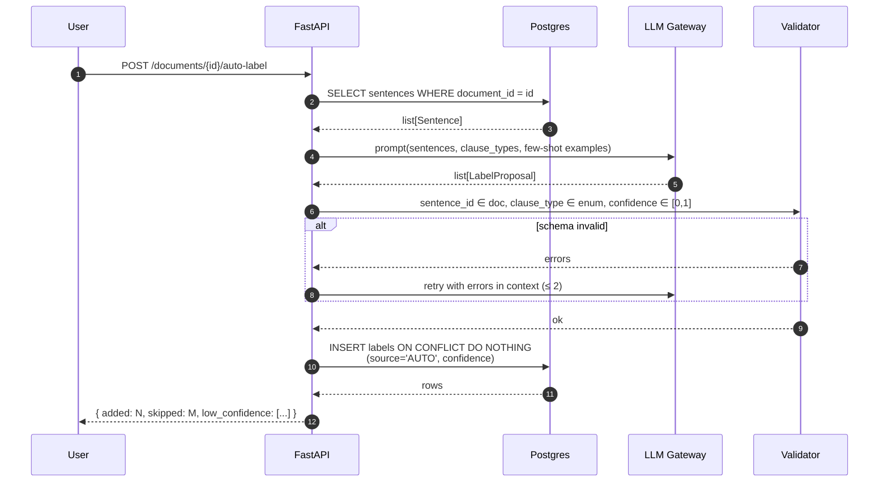
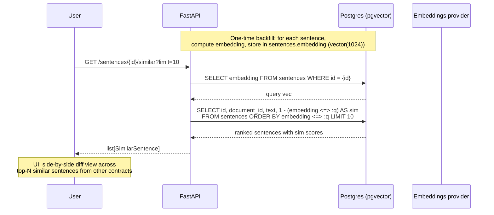
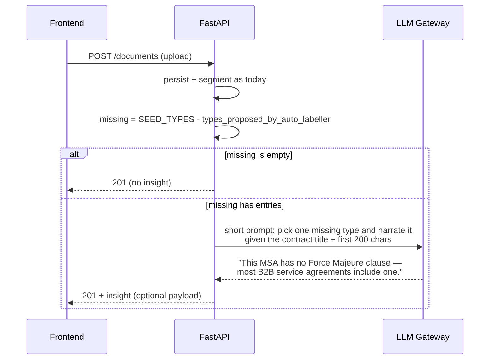

# AI features — proposed extensions

This document covers the bonus-points design work the case study hints at.
**Nothing here is implemented in the current codebase**; the schema seam is
in (`labels.source` ENUM and `labels.confidence`), and three features are
designed so the pair-programming follow-up session has a clear landing pad.

## Design principles

Three load-bearing decisions shape every feature below. None of them are
LLM-specific — they're the ones that keep the model honest, cheap, and
out of the security boundary.

| Principle | What it means in practice |
|---|---|
| **The LLM emits a typed JSON object — never SQL, never free-form text the app trusts.** | Auto-labelling is exactly this shape: `LabelProposal { sentence_id, clause_type, confidence, rationale }`. A schema validator rejects anything off-enum or out-of-document; up to two retries with the error in context, then we fall back to the user. The model has no credentials and no path to write anything the schema doesn't already allow. |
| **Determinism wherever it's free.** | Set differences, enum lookups, embedding similarity — do them in code, not in the model. The LLM's job is narration, ranking, and classification on text where rules don't fit. Save the tokens (and the latency, and the variance) for what only an LLM can do. |
| **Keep the LLM out of the request path when you can.** | Embeddings (feature 2) are precomputed; the runtime query is a pgvector ANN lookup, sub-50ms, zero LLM calls. Compare that to a chat-style Q&A on every interaction — same outcome, two-orders-of-magnitude slower and more expensive. |

**A chat-style natural-language Q&A surface was considered and rejected.**
Legal workflow is comparison and scanning, not conversation. The
keyboard-driven dashboard with filter chips + counts is already faster
than chat would be for "show me every confidentiality clause." Semantic
similarity (feature 2) gives the same "find me clauses like this one"
superpower without an LLM in the request path.

---

## 1. Auto-labelling (the pair-programming target)



### The typed contract

```python
class LabelProposal(BaseModel):
    sentence_id: int        # must exist in the requested document
    clause_type: ClauseType # the existing StrEnum
    confidence: float       # 0.0 – 1.0
    rationale: str          # ≤ 200 chars, surfaced as a tooltip
```

The validator is the security boundary: off-enum `clause_type`, out-of-doc
`sentence_id`, or confidence outside `[0, 1]` all reject the proposal and
trigger one retry with the error in the conversation. The LLM has no
credentials, no SQL surface, no path to write anything the schema doesn't
already allow.

### Why the AUTO seam is already in the schema

```python
class Label(Base):
    source: Mapped[str] = mapped_column(
        CheckConstraint("source IN ('MANUAL','AUTO')"),
        default="MANUAL",
    )
    confidence: Mapped[float | None] = mapped_column(nullable=True)
```

Auto-labels render with a subtle dotted border and a confidence tooltip
("Auto · 0.87"). Confirming an auto-label flips `source` to `MANUAL`;
removing it deletes the row.

### Two entry points

| Endpoint | When it fires | Model |
|---|---|---|
| `POST /documents/{id}/auto-label` | After upload (background) **or** "Suggest labels for this contract" button | Haiku, batched per document |
| `POST /sentences/{id}/suggest-labels` | "✨ Suggest" button next to "Add label" on one sentence | Haiku per call |

Low-confidence proposals (`< 0.5`) can be re-run on Sonnet on demand. The
budget per contract is dominated by tokens-in (the sentence list), so even
at 100 sentences per contract, Haiku is < $0.005 per run.

### Use cases

- **First-pass triage on a fresh upload.** A junior lawyer uploads a
  60-page MSA. Without auto-labelling they read every sentence and tag
  the relevant ones (~20 minutes). With it: the system proposes 15
  labels across 6 clause types in ~6 seconds, and the lawyer skims +
  accepts in 3 minutes. Net: ~6× faster, with calibration so they know
  which proposals to scrutinise (low-confidence ones).
- **Single-sentence disambiguation.** A senior lawyer is reviewing a
  clause and isn't sure if it's *Indemnification* or *Limitation of
  Liability* — the wording straddles both. They click ✨ Suggest; the
  model returns `{ clause_type: indemnification, confidence: 0.62,
  rationale: "Provider agrees to hold harmless against third-party
  claims — characteristic of indemnification, not LoL" }`. The rationale
  is the value here, not the label — it's a second opinion that takes
  one second.
- **Coverage audit across the library.** A compliance officer wants to
  know which contracts in a 500-contract library don't have *any*
  Termination clause labelled. They run auto-labelling overnight as a
  batch; in the morning the dashboard's group-by-type view shows the
  Termination bucket, and they can spot contracts that should be there
  but aren't.

### Evaluation — and the honest version of "F1"

This is the part most ML-feature proposals over-promise. Be honest about
the data shape:

- The auto-labelled set is **sparse on purpose** — lawyers label what they
  care about, not every relevant sentence. Treating the unlabelled
  remainder as "true negatives" inflates precision and deflates recall, so
  classical F1 against a typical hand-labelled corpus is **misleading**.
- The metrics that actually matter at deploy time:
  1. **Per-class precision** on a small, *exhaustively* hand-labelled gold
     set (one contract per clause type, fully tagged). 50–100 sentences
     total — small enough to maintain.
  2. **Calibration** — do confidence-0.9 proposals turn out correct ~90% of
     the time? A reliability diagram answers this; a CI check can assert
     the bins stay within ±10%.
  3. **User confirm-rate** in the UI — of proposals shown, what fraction
     does the user accept? This is the production north star.
- CI gate: **precision ≥ 0.8** on the exhaustively-labelled subset, no
  worse than the previous run. Confidence-calibration check is informative
  but not blocking until the corpus is bigger.

The eval harness lives at `backend/tests/eval/` and runs on demand
(`uv run pytest tests/eval -m llm`) — not on every commit, because it
costs API calls. Nightly in CI is the natural cadence.

---

## 2. Semantic clause similarity ("find clauses like this one")

This is the feature a legal team actually asks for: **show me every
Limitation of Liability clause in my library that looks like this one**.
It's the bridge from labelling to comparison, and it's the genuine
legal-tech differentiator vs a regex-based clause finder.



### Why this beats chat as feature #2

- **Legal workflow is comparison-heavy**, not question-asking. Lawyers
  compare clauses across contracts, against templates, against precedent.
  This feature is the primitive for all of those.
- **No LLM in the request path.** Embeddings are computed offline (or at
  upload time); the search is a pure pgvector ANN query. Sub-50ms.
- **Cost is bounded by `O(corpus size)` for embedding, not query volume.**
  Embedding a million sentences costs ~$10 once. Querying is free
  thereafter.
- **Composable with auto-labelling.** If a sentence's nearest neighbours
  all carry the same clause type, that's a strong signal — a cheap
  ensemble member that doesn't need a 70B LLM.

### Schema delta

```sql
ALTER TABLE sentences ADD COLUMN embedding vector(1024);  -- pgvector extension
CREATE INDEX ON sentences USING hnsw (embedding vector_cosine_ops);
```

Nothing else changes. No new tables. The embedding is just a column.

### Backfill strategy

- New sentences are embedded synchronously at upload (the segmentation
  pass already loops over every sentence — adding one HTTP call to the
  embedding provider is cheap).
- Existing rows are backfilled by a one-off script that paginates and
  calls the provider in batches.
- A retry policy on the embedding call (3 attempts, exponential backoff)
  is sufficient; failure leaves `embedding IS NULL` and the sentence
  drops out of similarity results until the next backfill.

### Use cases

- **Outlier detection on a clause-by-clause basis.** A lawyer is
  reviewing the *Limitation of Liability* clause in an incoming MSA from
  a new vendor. They click "Find similar" → the top 10 LoL clauses from
  their own library appear, ranked. The new one is 0.62 similar to its
  nearest match (most LoL pairs in the library are 0.85+). That's a
  signal: the wording is genuinely unusual. The lawyer reads it more
  carefully.
- **Precedent reuse.** A junior is drafting a new vendor agreement and
  remembers writing a clean *Termination for Convenience* clause six
  months ago in some contract but doesn't remember which. They go to
  any old TfC clause in the system, click "Find similar," and the
  one they wrote pops up at rank 1. Copy, adapt, done.
- **Boilerplate detection across a portfolio.** Pick the *Governing
  Law* sentence from a known canonical template. Run similarity across
  the whole library at threshold 0.92. Every contract whose GL clause
  matches the template is fine; the ones that don't (lower similarity)
  are the ones the team negotiated bespoke language for — interesting
  cohort to inspect.
- **Soft duplicate detection on upload.** When a new contract is
  uploaded, run similarity on its first 5 sentences against the
  library. If multiple sentences score > 0.95 against the same other
  document, surface it: "This contract is 96% similar to
  `vendor-x-2024.md` — did you mean to upload it as a new version?"

---

## 3. Upload insight ("I noticed…")

A small delight feature: after a contract uploads, surface one observation
about what it does or doesn't contain.



This is a **set difference plus one narration call**. It's tempting to
dress it up as "deterministic stats with the LLM picking a signal," but
honestly: it's a set operation on a seven-element enum followed by an LLM
call to phrase one missing item. Keep it lightweight — don't build a
`corpus_stats()` service for what's a one-line query and a prompt.

In the UI the insight renders as a dismissible callout on the new
document's detail page. Cost is one Haiku call per upload (~$0.0001).

### Use cases

- **Missing-clause flagging on B2B services agreements.** A vendor MSA
  arrives without a Force Majeure clause. The system spots the absence
  and surfaces "This Master Services Agreement has no Force Majeure
  clause — atypical for B2B services." The lawyer either pushes back on
  the counterparty or notes the omission as an accepted risk.
- **Pre-signature checklist for outbound contracts.** Right before a
  contract goes out, the insight flags any standard clause that
  auto-labelling didn't find. Catches the case where the legal team
  meant to include something and forgot. The callout is
  dismissible — the lawyer can mark it as deliberate.
- **Onboarding new clause types.** When a new clause type is added to
  the seed enum (say, *Data Processing* under GDPR), the insight
  becomes the discovery channel: existing contracts without one get a
  callout the next time someone opens them, surfacing the gap without
  a back-office sweep.

---

## What I considered and chose not to build

- **Chat over the library.** A natural-language Q&A front-end. Considered
  and rejected: legal workflow is comparison and scanning, not
  conversation. The dashboard's keyboard-driven search + filter chips
  with counts is already faster than chat would be, and the
  proposed semantic-similarity feature gives the "find me clauses like
  this" superpower without the latency cost of an LLM in the request
  path.
- **Drafting / generating clauses.** Out of scope for a labelling tool.
  A redline / risk copilot is a much larger product than what the case
  study hints at.
- **Fine-tuning.** Premature until the eval-harness corpus is large
  enough to train against. Few-shot examples (~5 per clause type) inside
  the prompt cover the seed enum well in practice.
- **PDF/DOCX parsing.** Input is text + markdown by the case study's
  scope. An OCR/layout layer would land *before* segmentation if needed.
- **Multi-tenant.** Today's app is single-tenant. The chokepoint
  for adding `org_id` + RBAC is `app/deps.py:get_db` — that's a clean seam
  but not blocking for any AI feature.

---

## Scaling — what changes at 10×, 100×, 1000× contracts

| Concern | Today | 10× | 100× | 1000× |
|---|---|---|---|---|
| **Segmentation** | sync in upload request | unchanged | worker queue (Inngest/RQ) on upload, status-poll | + OCR/layout pre-processing for non-text inputs |
| **Search** | `LOWER(col).contains()` | + trigram GIN index | `tsvector` full-text + ranking | + pgvector for semantic search (also serves feature 2) |
| **Auto-labelling** | (this proposal) per request | per request | batched worker, embeddings cached | + small fine-tuned classifier (Haiku-distilled) for the 4 highest-volume clause types; LLM falls back for low-confidence and rare types |
| **Embedding refresh** | n/a | sync per upload | + nightly backfill for new clause types added | + incremental re-embed only on segmentation algorithm change |
| **Dashboard query** | single endpoint, no pagination | + `?limit=&cursor=` | + denormalize `clause_types[]` onto the document row | + read replica for dashboard reads |
| **Storage** | content as `TEXT` in Postgres | unchanged | move document body to object storage; keep sentences + labels + embeddings in Postgres | + signed-URL retrieval |
| **LLM cost** | n/a | budget per tenant; prompt-cache the clause-type enum + few-shot block | per-tenant quotas; batch low-priority overnight | most volume served by the fine-tuned classifier; LLM only for novel types |
| **Observability** | container logs | + `structlog` + Sentry | + eval harness in CI + LLM-call tracing | + drift detection on AUTO confidence; per-tenant cost dashboards |

The inflection point is **a worker queue for auto-labelling at 100×
contracts**. Below that, synchronous in the request is fine and simpler.

---

## How I'd actually phase this in

This is a four-hour case-study app, so I'm calling out the realistic phasing,
not a 12-month roadmap:

1. **The pair-programming session** (the one the case study hints at): add
   `POST /documents/{id}/auto-label` + the `LabelProposal` validator + a
   single Haiku prompt with 5 few-shot examples per clause type. Render
   proposed labels in the UI with the dotted border + confidence tooltip.
   No eval harness yet.
2. **One iteration later**: stand up the eval harness with one
   exhaustively-labelled contract per clause type (50–100 sentences
   total). Per-class precision + calibration. Add the `/suggest-labels`
   per-sentence variant.
3. **Once there are 100+ documents in the system**: add embeddings +
   pgvector for the similarity feature. Replace the synchronous embedding
   call with a worker queue.
4. **Once a labelled corpus exists**: distill the high-volume clause types
   to a fine-tuned classifier; reserve the LLM for the long tail.

Each step earns its complexity from the previous step's data, not from a
roadmap.

See [`architecture.md`](architecture.md) for the system-level design,
[`api.md`](api.md) for the endpoints these would extend, and
[`features.md`](features.md) for the current user-facing scope.
