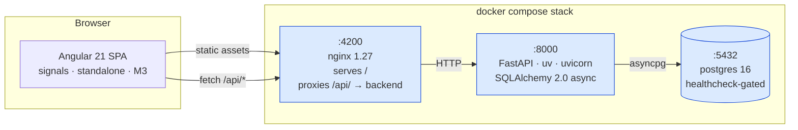
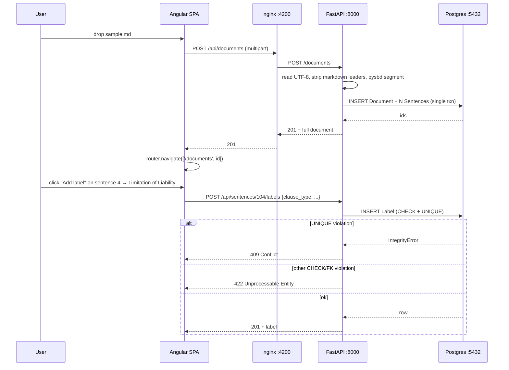
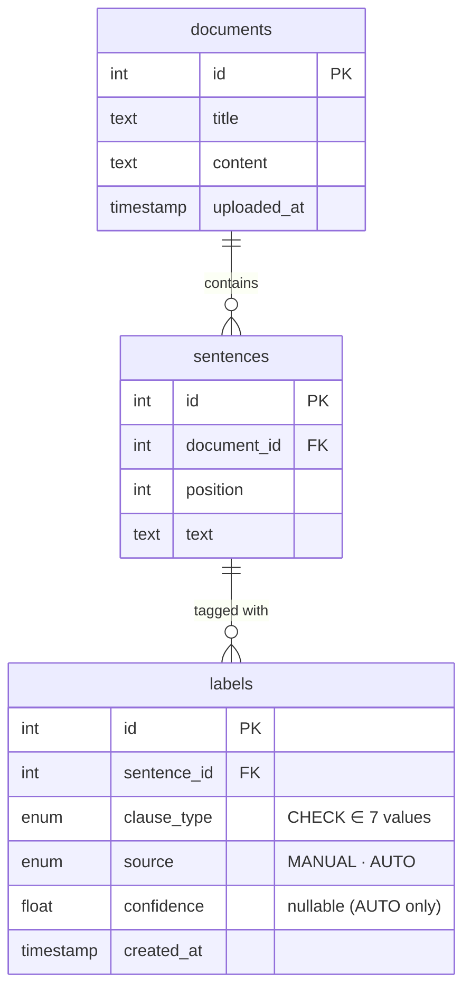
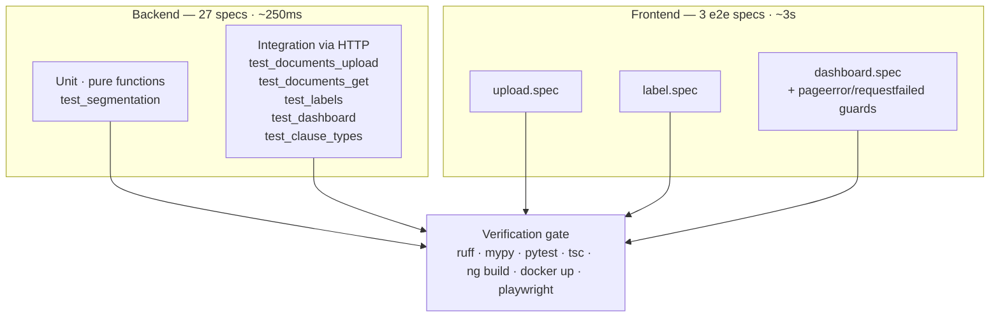

# Architecture

## System diagram

Three containers, all healthcheck-gated. Bring it up with `docker compose up`.

## Request flow — uploading and labelling

## Domain model

**Unique constraints.** `sentences(document_id, position)` so ordering is data,
not display; `labels(sentence_id, clause_type)` so the same type can't be
applied twice — the manual UI relies on this to be idempotent (409 on
duplicate), and an auto-labeller will rely on it for `INSERT … ON CONFLICT DO
NOTHING`.

**Cascades.** Both foreign keys are `ON DELETE CASCADE`. Deleting a document
removes its sentences and their labels in a single statement.

**Why `CHECK` not Postgres `ENUM`.** ENUMs require a migration to add a value;
the CHECK constraint is regenerated from `app/clause_types.py:ClauseType` (a
`StrEnum`), so adding a clause type is a one-file change. The constant
`_VALID_CLAUSE_TYPES_SQL` in `app/models.py` is computed from the enum so the
two cannot drift.

## Why this shape

| Choice | Alternative considered | Why this won |
|---|---|---|
| **FastAPI + SQLAlchemy 2.0 async** | Django, Flask | Pydantic v2 is the DTO layer — one schema for OpenAPI + validation + serialization. Async story matches frontend streaming once we add LLM features. |
| **`pysbd` for segmentation** | regex on `[.!?]`, spaCy | Legal abbreviations (`Mr.`, `Jan. 1, 2025`, `i.e.`) split incorrectly on regex; spaCy needs a 350 MB model and would still need post-processing. `pysbd` is pure-Python, deterministic, MIT. |
| **Closed-set `StrEnum` + CHECK** | join table `clause_types` | The set is closed (7 entries) and rarely changes. A join table adds a join on every dashboard query, a seed migration, an endpoint, and a Pydantic model — for data that's already a constant in code. |
| **`labels.source` + `confidence` columns** | nothing (defer) | These are the *only* schema concession to the case-study's auto-labelling pair-programming session. They cost nothing now and turn the auto-labeller into one `INSERT … ON CONFLICT DO NOTHING`. See [`ai-features.md`](ai-features.md). |
| **Server-side search/filter/group on one endpoint** | three endpoints | The same resource, three orthogonal filters. Splitting forces the frontend to coordinate three requests and reconcile results client-side. Single endpoint is one DB roundtrip and one Pydantic response. |
| **Multi-`?type=` is OR'd** | AND | "Show me contracts with LoL **or** Non-Compete" matches a legal team's mental model. AND would require already knowing the intersection exists. |
| **SQLite in-memory for tests, Postgres in prod** | testcontainers, dockerized Postgres in CI | Hermetic <300 ms full test suite. Portable schema (`CHECK` constraints rather than Postgres `ENUM` types; `func.lower().contains()` rather than `ILIKE`) keeps the two aligned. |
| **Angular Material (M3)** | hand-rolled CSS, PrimeNG, Tailwind | The case study explicitly grades intuitive UX. Material gives accessible defaults for cards, chips, menus, snackbars, spinners. M3 azure-blue theme is brand-neutral. |
| **Signals, no NgRx** | NgRx, Akita | One screen of state. Adding a store would be ceremony. Signals + a single `ApiService` is enough. |

## Test strategy

- **Tests verify behaviour through the public HTTP interface.** No mocking the
  DB, no asserting on call counts, no reading private attributes. One
  exception (`test_deleting_document_cascades_to_labels`) is a schema-integrity
  test at the model layer because there's no API surface for deleting a
  document yet — and that's commented in the test.
- **Sub-second backend suite** thanks to `sqlite+aiosqlite:///:memory:` and
  `StaticPool`. PRAGMA `foreign_keys=ON` is enabled in the fixture so SQLite
  honours `ON DELETE CASCADE` like Postgres.
- **Playwright e2e** runs against the live docker stack. The dashboard spec
  registers `pageerror` and `requestfailed` listeners and asserts both are
  empty at the end of the flow — this is how the chip-filter render loop bug
  that surfaced post-ship will be caught on the next regression.
- **TDD discipline.** Every feature went through `red-green-refactor`. One
  failing test at a time. The `red-green` skill (auto-fired by "implement X",
  "add the endpoint", "build the dashboard" intent words) enforces this.

See [`features.md`](features.md) for the end-user-facing tour, and
[`ai-features.md`](ai-features.md) for the proposed AI extensions.
