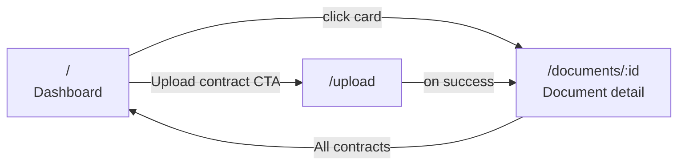

# Features

A short, screenshot-free tour of what the app does today.

## The three pages

### 1. Dashboard (`/`)

The library view.

- **Header** with brand, dashboard link, and a primary "Upload contract" CTA.
- **Search box** — debounced 200ms. Case-insensitive substring match on title
  and content via `func.lower(col).contains(q)` (portable between SQLite tests
  and Postgres prod).
- **Group-by toggle** — when on, the response shape switches to grouped and
  documents appear under every clause type they carry at least one label of.
- **Clear filters** — appears only when filters are active.
- **Clause-type chip filter** — seven chips (one per seed type). Multi-select
  is OR semantics. Each chip shows the **count of documents that would match
  if clicked**, and chips with `count: 0` are disabled with a tooltip — so
  the user never clicks a button that returns nothing. Counts respect the
  active search query.
- **Document cards** — title, upload date, sentence count, label count, plus
  one colour-coded chip per distinct clause type present in the document.
- **Empty states** — distinct for "no contracts yet" (zero in DB) and "no
  labelled clauses match" (filter eliminated all matches).

### 2. Upload (`/upload`)

- Drag-and-drop zone with a file-picker fallback ("Choose file").
- File-type whitelist: `.txt` and `.md`. The case study scopes input to text
  and markdown; PDF/DOCX is out of scope.
- After picking a file, a Cancel/Upload action row appears with the file name
  and size.
- On success: snackbar confirmation + immediate redirect to
  `/documents/:id` so the user sees their segmented sentences.
- On failure: snackbar with the API error detail. `415` for non-UTF-8 input,
  `422` for unhandled validation.

### 3. Document detail (`/documents/:id`)

- Title, upload timestamp, sentence count.
- Each sentence is its own row with a position index, the sentence text, and
  an "Add label" button.
- Clicking "Add label" opens a `mat-menu` of the 7 clause types.
- Selecting a type creates the label and the chip appears inline with a
  remove (`×`) button.
- Removing a chip immediately calls `DELETE /labels/{id}`.
- Idempotency: applying the same clause type twice on the same sentence
  returns `409` from the API — the UI swallows this gracefully because the
  end state is the same.
- An "All contracts" back link returns to the dashboard.

## Behaviour highlights

| Behaviour | Where it shows up |
|---|---|
| Search by content, not just title | Search "liability" → contract titled `msa.md` matches because its body contains "liability" |
| OR semantics on type filter | Select `Confidentiality` + `Limitation of Liability` → docs with **either** label appear |
| Grouped view | Toggle "Group by clause type" → docs with both labels appear under both group headers |
| Original text is preserved byte-for-byte | Upload a file with smart quotes, the document detail shows them exactly |
| Markdown leaders don't pollute sentences | Upload `# Master Services Agreement\nThis agreement...` → "Master Services Agreement" and "This agreement..." become *separate* sentences, not one |
| Legal abbreviations stay together | "Mr. Smith signed on Jan. 1, 2025." segments as ONE sentence — `pysbd` knows about legal abbreviations |
| Empty filter state is informative | Type a query with zero hits → "No contracts yet" empty state (not a blank panel) |
| Chip counts | Filter chips show `Confidentiality (4) · Non-Compete (0)`; the 0-count chip is disabled |

## Keyboard and accessibility

- All buttons reachable with `Tab`, activated with `Enter`/`Space`.
- The "Add label" button opens a `mat-menu` with arrow-key navigation.
- Chip listbox supports left/right arrows and `Space` to toggle.
- Search input is a semantic `type="search"` with an `aria-label`.
- Filter chip row has `aria-label="Filter by clause type"`.
- Material's contrast defaults pass WCAG AA at the theme level.

See [`api.md`](api.md) for the HTTP contracts, [`architecture.md`](architecture.md)
for the system-level picture, and [`ai-features.md`](ai-features.md) for the
proposed AI extensions.
